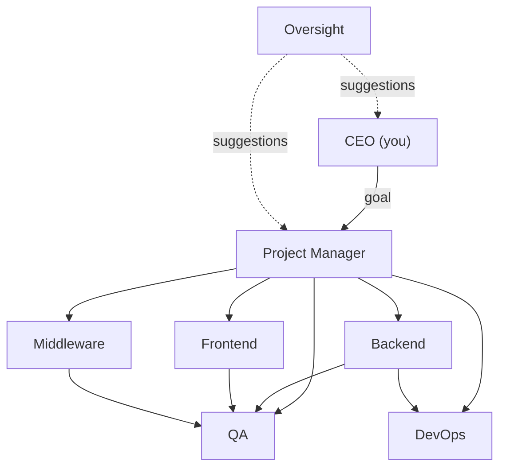

# Corp Swarm

**Local mission control for a corporate Cursor agent hierarchy.**

Corp Swarm is a self-hosted orchestrator that turns a single high-level goal into coordinated work across specialized AI agents — PM, backend, frontend, QA, DevOps, and more. You play the CEO: write a directive, watch handoffs flow through the org chart, and point the swarm at any local folder or GitHub repository.

Built on the [Cursor SDK](https://cursor.com/docs) (`@cursor/sdk`), agents run locally against a real codebase with durable handoff records, live transcripts, and metrics you can audit.

---

## Why Corp Swarm is useful

Most AI coding workflows rely on a single agent doing everything — planning, coding, testing, and deploying in one long conversation. That breaks down on real projects: context balloons, responsibilities blur, and failures are hard to trace.

Corp Swarm models how engineering teams actually work:

| Problem | How Corp Swarm solves it |
|---------|--------------------------|
| One agent tries to do everything | Role-based specialists with clear missions and boundaries |
| No audit trail of who did what | Every delegation is a durable handoff with acceptance criteria, artifacts, and linked transcripts |
| Silent stalls and crashes waste time | Silent-run watchdog, auto-retry, startup recovery, and manual stuck-work clearing |
| Token costs spiral on long tasks | Fresh agents per run, rolling goal digests, and capped context fields |
| QA and deploy happen too early | Pipeline gates — QA must pass before DevOps can ship |
| Prompts drift and failures repeat | Oversight loop mines friction and applies role prompt improvements |
| No visibility into spend | Per-directive token counts, wall time, and estimated USD cost |

The result is a **local, auditable, self-improving agent org** you control — not a black-box chat session.

---

## What it does

1. **You issue a CEO goal** — e.g. *"Add a health-check endpoint and a smoke test for it"*
2. **The PM agent plans** — breaks the goal into sequenced work packages with acceptance criteria
3. **Specialists execute** — backend, frontend, middleware, QA, and DevOps agents work in the target repo
4. **Handoffs are tracked** — every delegation is a first-class record with status, artifacts, and failure reasons
5. **Oversight improves the swarm** — an analyst agent mines logs and proposes prompt/process fixes



---

## Features at a glance

### Orchestration

| Feature | Description |
|---------|-------------|
| **Role-based agents** | Each role has a mission, boundaries, and structured JSON handoff contracts |
| **Handoff graph** | Enforced delegation rules — specialists escalate to PM, QA gates releases |
| **Pipeline gates** | Four-wave phases: build → wire → QA gate → deploy; lower waves must finish first |
| **Sequential pipeline** | Optional one-in-flight handoff per goal to prevent parallel chaos |
| **Any target repo** | Point agents at a local path or clone from GitHub (`owner/repo`, URL, or branch) |
| **Project brief** | Auto-detects languages, package managers, and test commands from the target repo |
| **Context compression** | Rolling goal digest and capped fields keep cross-agent memory token-efficient |
| **Smoke test canary** | Deterministic 4-wave plan for integration testing of the swarm itself |

### Reliability

| Feature | Description |
|---------|-------------|
| **Silent-run watchdog** | Detects stuck SDK agents with no output, cancels, rotates, and retries |
| **Startup recovery** | Auto-recovers orphaned runs, handoffs, and busy agents after server restarts |
| **Clear stuck** | Manual recovery from the dashboard after crashes or hangs |
| **Pause / resume** | Halt the queue without losing state |
| **Run timeout** | 10-minute cap per agent run |
| **Fresh agent per run** | Disposes agents after each run to save tokens (configurable) |

### Observability

| Feature | Description |
|---------|-------------|
| **Live dashboard** | Real-time org chart, handoff list, and streaming agent transcripts |
| **Pipeline tracker** | Milestone progress, ETA estimates, stall alerts, and bottleneck detection |
| **CEO review** | Failure triage with retry prefill for failed goals and handoffs |
| **CEO requests** | Per-directive cost, token, and pipeline analytics |
| **Metrics** | Per-role success rates, run durations, and handoff friction (failures, ping-pong) |
| **Prompt portal** | Inspect effective system prompts, runtime templates, and change history |
| **SQLite persistence** | Goals, handoffs, runs, and metrics survive server restarts |

### Continuous improvement

| Feature | Description |
|---------|-------------|
| **Oversight loop** | Analyst mines failure patterns and proposes role prompt fixes |
| **Role overrides** | Accepted suggestions become prompt overrides injected into future runs |
| **Auto-approve** | Optionally auto-apply oversight suggestions without manual review |

---

## Dashboard guide

The web dashboard runs at **http://localhost:5173** and connects to the server over WebSockets with HTTP polling fallback for transcript reliability.

### CEO directive

- Submit multi-line CEO goals to the PM
- **Pause / Resume** the swarm
- **Clear stuck** — recover orphaned work after crashes
- **Run oversight** — trigger the analyst and jump to the Oversight tab
- Shows auto-approve status when enabled

### Mission (primary operations view)

- **Active now** — current goal, busy agent chips, in-flight handoffs, running transcript links
- **Live stream** — Cursor-style step summaries (thinking, tool calls, orchestrator events, text) with expandable steps
- **Pipeline tracker** — milestone progress (PM planning → Build & wire → QA gate → Deploy → Outcome), progress bar, ETA, stall/ping-pong alerts, and bottleneck identification
- **Organization tree** — live status per role (idle, busy, error, paused); click to jump to a transcript
- **Handoffs audit trail** — full history with failed/rejected highlighting, acceptance criteria, failure reasons, and linked conversation runs

### CEO review

- Badge on nav when failures need attention
- **Agents in error** — click to jump to the failing transcript
- **Failed goals** — top failure reason, related handoffs, **Dispatch retry** (prefills the CEO directive)
- **Failed handoffs** and **recent failed runs** for quick triage

### CEO requests

- Fleet totals: requests, success rate, tokens, estimated cost, primary model, average wall time
- Per-directive expandable cards with outcome badge, wall time vs agent time, token breakdown, estimated USD cost, models used, agents spun up, and handoff failure counts
- **Pipeline step timeline** — handoff waves with nested runs
- **Per-role rollup** — time, tokens, cost, runs, handoffs, failures

### Prompts

- Stats: roles, changes logged, active overrides, last change
- **Project brief** injected into every system prompt
- **Runtime task templates** for PM planning, handoff execution, and oversight review
- Per-role inspector: base role pack, active overrides, effective assembled system prompt, and change history timeline

### Metrics

- Per-role **success rate bars** (finished vs errors/startup errors/cancelled)
- Run counts and failure counts per role
- **Handoff friction matrix** — total, failed, rejected, and ping-pong counts per edge

### Oversight

- Suggestion inbox with target role, finding, and proposed prompt change
- **Accept / Reject** pending suggestions (when auto-approve is off)

### Workspace targeting (footer)

- Retarget to a local path, `https://github.com/org/repo`, or `org/repo` with optional branch/ref
- Shows active path, GitHub source, and project brief preview
- Blocked while agents are busy (returns 409)

---

## Agent roles

| Role | Responsibility |
|------|----------------|
| **CEO** | You — submit goals via the dashboard |
| **PM** | Plans work, creates handoffs, owns acceptance criteria |
| **Backend** | APIs, data models, server-side logic |
| **Frontend** | UI, client state, user-facing flows |
| **Middleware** | Integration layers, auth glue, adapters |
| **QA** | Verifies acceptance criteria, runs tests, files defects |
| **DevOps** | CI/CD, scripts, environments, releases (only after QA GO) |
| **Oversight** | Mines logs for prompt and process improvements |

### Handoff graph

Handoff edges are enforced in `packages/roles`:

| From | Allowed to |
|------|-----------|
| CEO | PM |
| PM | Backend, Frontend, Middleware, QA, DevOps |
| Backend | PM, QA |
| Frontend | PM, QA |
| Middleware | PM, QA |
| QA | PM, Backend, Frontend, Middleware, DevOps |
| DevOps | PM, Backend |
| Oversight | CEO, PM (suggestions only) |

### Pipeline phases

When the PM plans work, handoffs are assigned gate phases:

| Phase | Roles | Gate |
|-------|-------|------|
| 1 | Backend, Middleware | Must complete before phase 2 |
| 2 | Frontend | Must complete before QA gate |
| 3 | QA | Must return `done` before DevOps |
| 4 | DevOps | Final deploy/release step |

---

## How a goal flows

```
CEO goal
  → PM plans (JSON: summary + handoffs[])
    → Queue dispatches handoffs to specialists (respecting gates)
      → Specialist returns JSON (status, artifacts, follow-ups)
        → QA verifies / DevOps deploys
          → Goal marked done (or failed with reason)
```

Every step is persisted. Handoff statuses progress through `queued` → `accepted` → `in_progress` → `done` / `failed` / `rejected`. The dashboard shows linked conversation runs and live streamed output.

Specialists can return follow-up handoffs. Blocked DevOps requests are escalated through PM when direct edges are not allowed.

---

## Quick start

### Prerequisites

- **Node.js** ≥ 22.13
- A **Cursor API key** ([get one from Cursor](https://cursor.com/settings))

### Install & run

```bash
git clone <your-repo-url>
cd brainstorming   # or your clone directory

npm install

# Add your API key
cp .env.example .env
# Edit .env and set CURSOR_API_KEY=cursor_...

# Terminal 1 — API + orchestrator (port 8787)
npm run dev:server

# Terminal 2 — Web dashboard (port 5173)
npm run dev:web
```

Open **http://localhost:5173**, set the agent workspace to a repo path or GitHub URL, then dispatch a CEO goal.

> **Tip:** While agents are running, prefer `npm run dev:once -w @corp-swarm/server` over `tsx watch` to avoid restarts mid-run.

### Scripts

| Command | Description |
|---------|-------------|
| `npm run dev:server` | Start Hono API, WebSocket server, and agent queue |
| `npm run dev:web` | Start Vite React dashboard (proxies `/api` and `/ws`) |
| `npm run build` | Build all workspaces |
| `npm run typecheck` | Type-check schema, roles, server, and web |

---

## Configuration

`corp-swarm.config.json` at the repo root. Runtime overrides (GitHub source, branch) are saved to `corp-swarm.config.local.json` (gitignored).

```json
{
  "targetRepo": "/path/to/your/project",
  "model": "composer-2.5",
  "maxConcurrentAgents": 2,
  "enabledRoles": ["pm", "backend", "frontend", "middleware", "qa", "devops", "oversight"],
  "serverPort": 8787,
  "webPort": 5173,
  "ceoAutoApprove": true,
  "silentStallMs": 120000,
  "maxSilentRetries": 2,
  "silentWatchdogIntervalMs": 15000,
  "sequentialPipeline": true,
  "maxConcurrentPerGoal": 1,
  "freshAgentPerRun": true,
  "maxRoleOverridesInPrompt": 3,
  "contextCaps": {
    "objective": 400,
    "contextSummary": 800,
    "acceptanceCriteriaItem": 120,
    "maxAcceptanceCriteria": 5,
    "digest": 1500,
    "resultSummary": 500,
    "roleOverride": 300
  }
}
```

| Option | Purpose |
|--------|---------|
| `targetRepo` | Default workspace agents edit (overridable in the UI) |
| `model` | Cursor SDK model for all agents |
| `maxConcurrentAgents` | Global parallel agent runs |
| `enabledRoles` | Which specialist roles the PM may dispatch |
| `ceoAutoApprove` | Auto-apply oversight suggestions as role overrides |
| `silentStallMs` | Kill agents that produce no output for this long |
| `maxSilentRetries` | Re-queue handoffs after silent stalls |
| `silentWatchdogIntervalMs` | How often the watchdog polls in-flight runs |
| `sequentialPipeline` | Enforce wave ordering and limit parallel handoffs per goal |
| `maxConcurrentPerGoal` | Max simultaneous handoffs per goal |
| `freshAgentPerRun` | Dispose agent after each run to save tokens |
| `maxRoleOverridesInPrompt` | Latest N oversight overrides injected into prompts |
| `contextCaps` | String length limits for objectives, digests, summaries, etc. |
| `githubSource` / `githubRef` | Persisted GitHub URL and branch (set via UI) |

You can also retarget at runtime from the dashboard — local paths, `https://github.com/org/repo`, or `org/repo` with an optional branch.

---

## API reference

### REST endpoints

| Method | Path | Description |
|--------|------|-------------|
| GET | `/api/health` | Health, API key presence, target repo, pause state |
| GET | `/api/config` | Full config + project brief |
| POST | `/api/config/target` | Retarget workspace (local or GitHub clone/pull) |
| GET | `/api/org` | Org roles, handoff graph, pause, queue depth |
| GET | `/api/goals` | All CEO goals |
| POST | `/api/goals` | Submit CEO goal |
| POST | `/api/goals/:id/fail` | Fail goal and terminate active handoffs |
| GET | `/api/goals/metrics` | Per-goal metrics snapshot |
| GET | `/api/handoffs` | All handoffs |
| GET | `/api/runs` | Conversation runs (optional `limit` query param) |
| GET | `/api/runs/:id` | Single run (for polling) |
| POST | `/api/swarm/pause` | Pause queue |
| POST | `/api/swarm/resume` | Resume queue |
| POST | `/api/swarm/recover` | Recover stuck runs, handoffs, and agents |
| POST | `/api/agents/:role/cancel` | Cancel in-flight run and fail role's handoffs |
| GET | `/api/metrics` | Fleet metrics + friction |
| GET | `/api/prompts` | Prompt portal snapshot |
| GET | `/api/suggestions` | Oversight suggestions |
| POST | `/api/oversight/run` | Run oversight analyst |
| POST | `/api/suggestions/:id/accept` | Accept suggestion → apply role override |
| POST | `/api/suggestions/:id/reject` | Reject suggestion |

### WebSocket events

Connect to `/ws`. Event types:

`agent_status` · `handoff_updated` · `goal_updated` · `run_started` · `run_chunk` · `run_finished` · `suggestion_created` · `swarm_state` · `target_changed` · `error`

---

## Project structure

```
brainstorming/
├── apps/
│   ├── server/          # Hono API, WebSocket, SQLite, Cursor SDK orchestrator
│   └── web/             # React mission-control dashboard
├── packages/
│   ├── schema/          # Zod types: goals, handoffs, runs, config, WS events
│   └── roles/           # Role packs, system prompts, handoff graph
├── data/                # SQLite DB and GitHub clones (gitignored)
├── corp-swarm.config.json
└── .env                 # CURSOR_API_KEY (gitignored)
```

### Key server modules

| Module | Role |
|--------|------|
| `orchestrator.ts` | Creates, resumes, and rotates Cursor SDK agents per role |
| `queue.ts` | Goal planning and handoff execution with concurrency limits |
| `handoff-gates.ts` | Pipeline phase ordering and QA/DevOps release gates |
| `silent-watchdog.ts` | Detects and recovers from silent SDK stalls |
| `context-compress.ts` | Rolling goal digest and token caps |
| `project-brief.ts` | Sniffs the target repo (languages, package managers, tests) |
| `target-repo.ts` | Clone or pull GitHub repos for agent workspaces |
| `prompt-portal.ts` | Tracks prompt changes, overrides, and effective assembled prompts |
| `goal-metrics.ts` | Per-directive analytics, cost estimates, pipeline steps |
| `recover.ts` | Startup and manual recovery for stuck work |

---

## Tech stack

| Layer | Technology |
|-------|------------|
| **Runtime** | Node.js 22+, TypeScript, ESM |
| **Server** | [Hono](https://hono.dev), `ws`, `node:sqlite` |
| **Agents** | [@cursor/sdk](https://www.npmjs.com/package/@cursor/sdk) (local agents with `cwd: targetRepo`) |
| **Web** | React 19, Vite |
| **Schema** | Zod shared across server and client |

---

## Environment variables

| Variable | Required | Description |
|----------|----------|-------------|
| `CURSOR_API_KEY` | Yes | Cursor API key for SDK agent runs |

---

## License

Add your license here.
