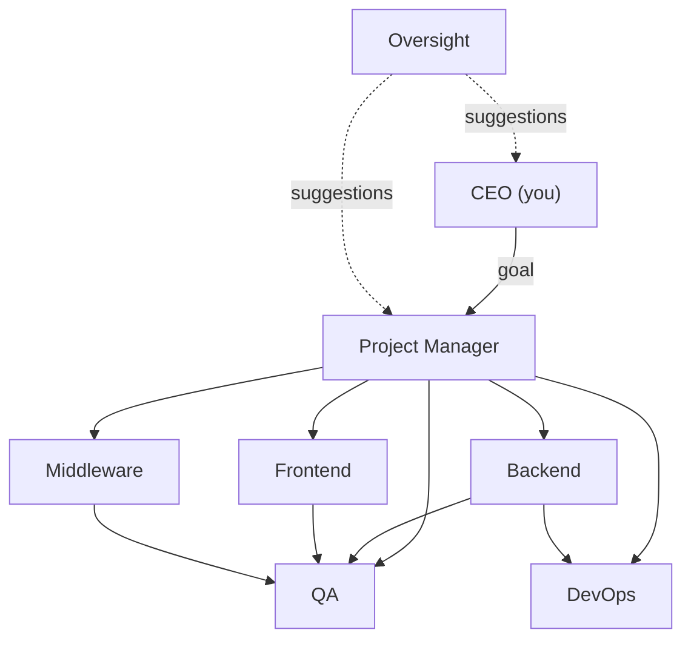

# Corp Swarm

**Local mission control for a corporate Cursor agent hierarchy.**

Corp Swarm is a self-hosted orchestrator that turns a single high-level goal into coordinated work across specialized AI agents — PM, backend, frontend, QA, DevOps, and more. You play the CEO: write a directive, watch handoffs flow through the org chart, and point the swarm at any local folder or GitHub repository.

Built on the [Cursor SDK](https://cursor.com/docs) (`@cursor/sdk`), agents run locally against a real codebase with durable handoff records, live transcripts, and metrics you can audit.

---

## What it does

1. **You issue a CEO goal** — e.g. *"Add a health-check endpoint and a smoke test for it"*
2. **The PM agent plans** — breaks the goal into sequenced work packages with acceptance criteria
3. **Specialists execute** — backend, frontend, middleware, QA, and DevOps agents work in the target repo
4. **Handoffs are tracked** — every delegation is a first-class record with status, artifacts, and failure reasons
5. **Oversight improves the swarm** — an analyst agent mines logs and proposes prompt/process fixes

The web dashboard shows live agent status, handoff audit trails, streaming transcripts, success rates, and handoff friction — all over WebSockets.



---

## Features

| Feature | Description |
|--------|-------------|
| **Role-based agents** | Each role has a mission, boundaries, and structured JSON handoff contracts |
| **Any target repo** | Point agents at a local path or clone from GitHub (`owner/repo`, URL, or branch) |
| **Handoff graph** | Enforced delegation rules — specialists escalate to PM, QA gates releases |
| **Live dashboard** | Real-time org chart, handoff list, and streaming agent transcripts |
| **SQLite persistence** | Goals, handoffs, runs, and metrics survive server restarts |
| **Silent-run watchdog** | Detects stuck SDK agents with no output, cancels, rotates, and retries |
| **Oversight loop** | Analyst proposes role prompt improvements from failure patterns |
| **Metrics** | Per-role success rates, run durations, and handoff friction (failures, ping-pong) |

---

## Agent roles

| Role | Responsibility |
|------|----------------|
| **CEO** | You — submit goals via the dashboard |
| **PM** | Plans work, creates handoffs, owns acceptance criteria |
| **Backend** | APIs, data models, server-side logic |
| **Frontend** | UI, client state, user-facing flows |
| **Middleware** | Integration layers, auth glue, adapters |
| **QA** | Verifies acceptance criteria, runs tests, files defects |
| **DevOps** | CI/CD, scripts, environments, releases |
| **Oversight** | Mines logs for prompt and process improvements |

Handoff edges are defined in `packages/roles` — e.g. PM → specialists, specialists → PM or QA, QA → owning engineer.

---

## Quick start

### Prerequisites

- **Node.js** ≥ 22.13
- A **Cursor API key** ([get one from Cursor](https://cursor.com/settings))

### Install & run

```bash
git clone <your-repo-url>
cd brainstorming   # or your clone directory

npm install

# Add your API key
cp .env.example .env
# Edit .env and set CURSOR_API_KEY=cursor_...

# Terminal 1 — API + orchestrator (port 8787)
npm run dev:server

# Terminal 2 — Web dashboard (port 5173)
npm run dev:web
```

Open **http://localhost:5173**, set the agent workspace to a repo path or GitHub URL, then dispatch a CEO goal.

### Scripts

| Command | Description |
|---------|-------------|
| `npm run dev:server` | Start Hono API, WebSocket server, and agent queue |
| `npm run dev:web` | Start Vite React dashboard (proxies `/api` and `/ws`) |
| `npm run build` | Build all workspaces |
| `npm run typecheck` | Type-check schema, roles, server, and web |

---

## Configuration

`corp-swarm.config.json` at the repo root:

```json
{
  "targetRepo": "/path/to/your/project",
  "model": "composer-2.5",
  "maxConcurrentAgents": 2,
  "enabledRoles": ["pm", "backend", "frontend", "middleware", "qa", "devops", "oversight"],
  "serverPort": 8787,
  "webPort": 5173,
  "ceoAutoApprove": true,
  "silentStallMs": 90000,
  "maxSilentRetries": 2,
  "silentWatchdogIntervalMs": 15000
}
```

| Option | Purpose |
|--------|---------|
| `targetRepo` | Default workspace agents edit (overridable in the UI) |
| `model` | Cursor SDK model for all agents |
| `maxConcurrentAgents` | Parallel agent runs |
| `ceoAutoApprove` | Auto-apply oversight suggestions as role overrides |
| `silentStallMs` | Kill agents that produce no output for this long |
| `maxSilentRetries` | Re-queue handoffs after silent stalls |

You can also retarget at runtime from the dashboard — local paths, `https://github.com/org/repo`, or `org/repo` with an optional branch.

---

## Project structure

```
brainstorming/
├── apps/
│   ├── server/          # Hono API, WebSocket, SQLite, Cursor SDK orchestrator
│   └── web/             # React mission-control dashboard
├── packages/
│   ├── schema/          # Zod types: goals, handoffs, runs, config, WS events
│   └── roles/           # Role packs, system prompts, handoff graph
├── data/                # SQLite DB (gitignored)
├── corp-swarm.config.json
└── .env                 # CURSOR_API_KEY (gitignored)
```

### Key server modules

- **`orchestrator.ts`** — Creates, resumes, and rotates Cursor SDK agents per role
- **`queue.ts`** — Goal planning and handoff execution with concurrency limits
- **`silent-watchdog.ts`** — Detects and recovers from silent SDK stalls
- **`project-brief.ts`** — Sniffs the target repo (languages, package managers, tests)
- **`target-repo.ts`** — Clone or pull GitHub repos for agent workspaces

---

## How a goal flows

```
CEO goal
  → PM plans (JSON: summary + handoffs[])
    → Queue dispatches handoffs to specialists
      → Specialist returns JSON (status, artifacts, follow-ups)
        → QA verifies / DevOps deploys
          → Goal marked done (or failed with reason)
```

Every step is persisted. The dashboard shows handoff status (`queued` → `in_progress` → `done` / `failed`), linked conversation runs, and live streamed output.

**Pause / resume** the swarm, **clear stuck** work after crashes, or **run oversight** to generate improvement suggestions from recent activity.

---

## Tech stack

- **Runtime:** Node.js 22+, TypeScript
- **Server:** [Hono](https://hono.dev), `ws`, `node:sqlite`
- **Agents:** [@cursor/sdk](https://www.npmjs.com/package/@cursor/sdk) (local agents with `cwd: targetRepo`)
- **Web:** React 19, Vite
- **Schema:** Zod shared across server and client

---

## Environment variables

| Variable | Required | Description |
|----------|----------|-------------|
| `CURSOR_API_KEY` | Yes | Cursor API key for SDK agent runs |

---

## License

Add your license here.
